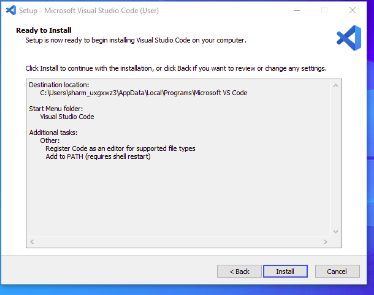

# Dev_Setup
Setup Development Environment

ASSIGNMENT: SETTING UP YOUR DEVELOPER ENVIRONMENT

1. Installing windows 11.

How to clean install with Windows 11 Installation Media
This is a way to create a bootable USB drive that you can use to clean install on your current Windows 10 PC .Visit https://www.microsoft.com/en-us/software-download/windows11  and from there, choose the Create Installation Media option then follow the steps below:

Step 1: Agree to the terms and choose Accept. Let the Setup tool run, and choose Use the recommended options for this PC. Click Next, and choose USB flash drive.
Step 2: Choose your USB flash drive from the list and then click Next. You'll be prompted and Windows 11 will download to it. Once finished, the installer will switch to Creating  Installation media. You'll know when it's finished, as you'll get a prompt that the drive is ready.

Step 3: Once your USB drive is ready, close the installer with the Finish button .Keep the USB drive plugged into your PC.
Step 4: Head back to the Windows 10 settings app, and choose Update & security. Then choose Recovery on the left side. Under Advanced startup, choose the Restart now option.
Step 5: In the pop-up prompt, choose Use a device. Your USB drive should appear listed. Choose it, and Windows will restart to your USB drive and Windows 11 installer. 

Step 6: Once in the Windows 11 installer, select a language, and click Next. Pick the version of  that matches the version of Windows 10 on your PC. and click Next.
Step 7: Choose the Custom option and choose the drive to install Windows 11 on. You might have to click the Format button to erase all your files on the drive. When done, select the drive again and click Next.

Step 8: Windows 11 will install to your PC, and you can sit back. You'll then be taken to the out-of-box experience, and will be prompted to set up your PC again.

2. INSTALLING VISUAL STUDIO CODE
Step 1.Visit  https://code.visualstudio.com/Download  and select “Download for Widows”.

Step 2. Wait for the download to finish and then head to downloads folder.
Step 3.Click on it initiate the installation process.
Step 4. After the installer opens,it will ask you to accept the terms and conditions of visual studio code.Click on I Accept the agreement  and then click the Next button.

Step 5. Choose the location data for running the vs code .It will then ask you to browse the location .Then click on the Next button.

Step 6.Then it will ask to begin the installation setup .Click on the Install button.

Step 7. This will take about 1 minute.
8.After the installation setup for visual studio code is finished, it will show window below.Tick the checkbox and click Next.

Step 9. Visual studio code window opens successfully .

3. VERSION CONTROL SETUP
    Step 1. Download the latest git for windows at https://gitforwindows.org/ 
    Step 2. After successfully starting the installer, you should see the Git setup wizard screen. Click      the Next and Finish prompts to complete the installation.
    Step 3. Create a GitHub Account-- Visit https://github.com  and sign up for a new account .
    Step 4. Open a git bash  and run the following commands to configure your Git username and email . 
            $ git config --global user.name "Daniel  Chacha"
            $ git config --global user.email "danmwita355@gmail.com"
    Step 5. While still at the git bash, navigate to your project folder using “cd Desktop/myfolder” or create one using      “mkdir project_name” then “ cd project_name”
    Step 6. Initialize ,commit and push the repository to github using:
            git init
            git add .
            git commit -m “My first project”
            git push

            

4. PYTHON INSTALLATION
    a) Visit the official python website https://www.python.org/ to download the latest version of python.
      

    b) Select the “Windows installer” option and click on the “Download” button. Once the download is complete, run the installer.heck the boxes “Use admin privileges when installing py.exe” and “Add python.exe to PATH” to save the trouble of manual adjustments in the environment variable later.
      

    c) Follow the on-screen instructions during the preceding stages.Once installation is complete you should see the a message like this:
    d) Verify that the installation is complete using python -v   on the command prompt.
   

5. INSTALLING PACKAGE MANAGERS

    • On the command prompt, check whether  pip is installed by executing:
      pip –version   since it comes by default after downloading python.

6. CONFIGURE MYSQL
    • Visit https://dev.mysql.com/downloads/installer/ and click on the first download button.
     

    • On the mysql Homepage, click on the “No thanks, just start my download” link to proceed mysql downloading.
     

    • After mysql downloading MySQL.exe file , go to your down	loads folder , find the file and double click to run the installer.
    
    • The installer will instruct you to choose the setup type. For most users , the “Developer Default” is suitable. Click “Next” to proceed.

    • You will be prompted to install typical MySQL software .The installer can auto-resolve some of issues, but not in this case.
    
    • In the download section click, “Execute” to start downloading the content you selected.Click “Next”
    
    • Proceed to 	“Product configuration” > “Type and Networking” > “ Authentication Method” pages by clicking the “Next” button.
    • Create  a password for the MySQL root user.Ensure it is strong and memorable.Click Next to proceed.
    • Connect to server: Enter the root password , click “Check” .If it says “Connection Succeed” you have successfully connected to the server.
    • Once installation is complete , click “Finish” .
    

    • To verify installation, open MySQL  command line client  at your start menu  and login using the root user credentials you set during installation.

8.EXTENSIONS AND PLUGINS
To install extensions , open vs code,  go to Extensions view( ctrl +shift +X).
Examples of extensions I installed:
    • Flutter files
    • Auto close tag
    • Auto complete tag
    • C/C++
    • Code runner
    • color Highlight
    • Dart
    • Django-intellisence 

CHALLENGES FACED DURING SETUP AND STRATEGIES DEVELOPED TO OVERCOME THEM

    • Challenge: Compatibility issues, errors during installation.
      Solution: I Followed the official troubleshooting guide provided by Microsoft for common installation and activation issues.
    • Challenge: Network issues .
      Solution: I used a download manager to ensure the download completes successfully. 
    • Challenge: Extension conflicts or performance issues. 
      Solution: I checked  user reviews and documentation for each extension to ensure compatibility.
    • Challenge: Connection errors between my application and the MySQL database. Solution: Ensured MySQL is running and accessible on the correct port (default is 3306).

   

   GITHUB REPOSITORY CONTAINING A SAMPLE PROJECT INITIALIZED WITH GIT
   -Here is the link to my repository initialized with git:
   https://github.com/Daniel-Chacha/E-commerce-with-Django.git

#Deliverables:
- Document detailing the setup process with step-by-step instructions and screenshots where necessary.
- A GitHub repository containing a sample project initialized with Git and any necessary configuration files (e.g., .gitignore).
- A reflection on the challenges faced during setup and strategies employed to overcome them.

#Submission:
Submit your document and GitHub repository link through the designated platform or email to the instructor by the specified deadline.

#Evaluation Criteria:**
- Completeness and accuracy of setup documentation.
- Effectiveness of version control implementation.
- Appropriateness of tools selected for the project requirements.
- Clarity of reflection on challenges and solutions encountered.
- Adherence to submission guidelines and deadlines.

Note: Feel free to reach out for clarification or assistance with any aspect of the assignment.

